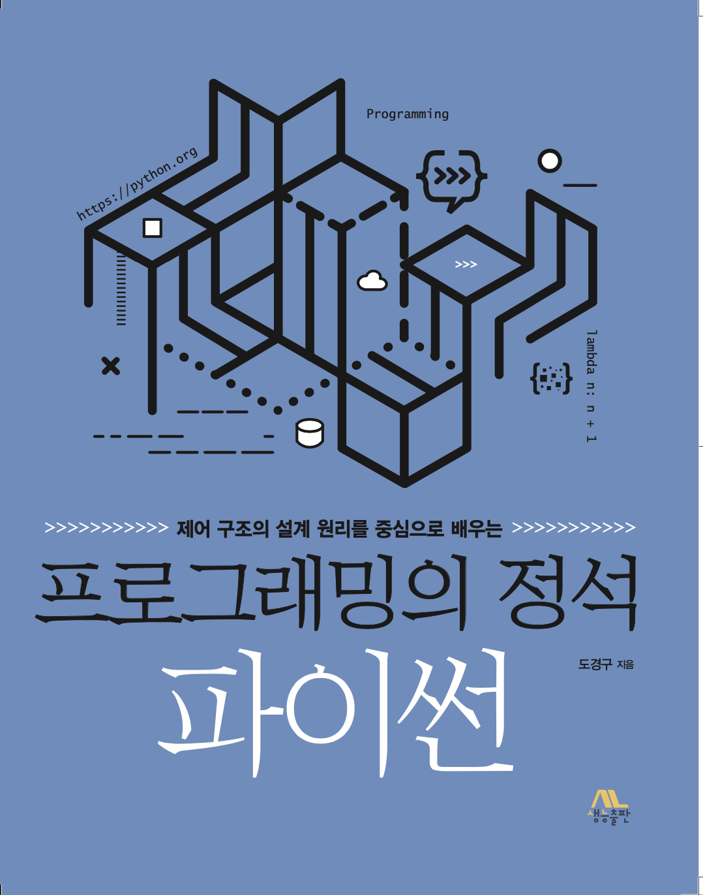

제어 구조의 설계 원리를 중심으로 배우는 프로그래밍의 정석 : 파이썬 (도경구 지음, 생능출판사 펴냄)

#### 학습 자료
- [강의비디오](https://youtube.com/playlist?list=PL0UNsS2daHTyoDTctKpITfbW1UtR5ig6L)
- [자료저장소](https://github.com/Doggzone/pppython)

#### 정오표
- [초판1쇄](errata/초판1쇄오타목록.pdf) (발행 2020년 12월 29일)

#### 표지

